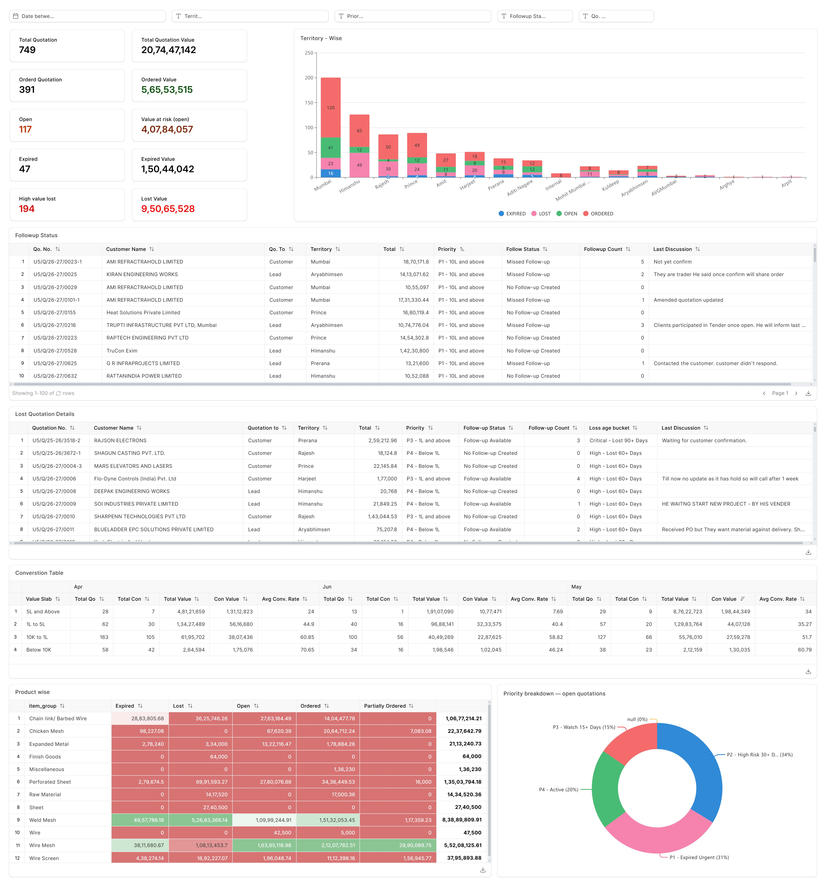

# Quotation Health Tracker

> An **ERPNext Insights** dashboard that keeps the live sales pipeline healthy — flagging open, ageing, expired and at-risk quotations by priority, territory and value-slab, so the team follows up on the right deals *before* they're lost.

<!--
  Dashboard below is a SYNTHETIC RECONSTRUCTION (fake data) mirroring the real
  ERPNext Insights layout. No company data. Rebuild via scripts/render_dashboard.py
-->

> ⚠️ **Data note:** the dashboard above is a **synthetic reconstruction** mirroring the real ERPNext Insights report's layout and metric structure. It uses generated data — **no company customer names, staff or financials are shown.** Regenerate it with [`scripts/render_dashboard.py`](scripts/render_dashboard.py).

---

## 📖 Overview

A quotation that sits untouched is a deal quietly dying. This dashboard is the **daily follow-up cockpit** for the sales team — it takes every live quotation and answers: *is it open, ageing, expired or at risk; how much value is exposed; whose desk is it on; and how urgently does it need a call today?*

Where [Lost Quotation Analysis](https://github.com/abilash-abii) is the **post-mortem** (why we lost), this is the **prevention layer** (act before we lose). Built in **ERPNext Insights**.

---

## 🎯 Business Problem

- ⏳ **Quotations expiring silently** — deals lost simply because no one followed up in time.
- 💰 **No view of value at risk** in the open pipeline.
- 🧭 **No prioritisation** — reps chased whatever they remembered, not the most urgent/valuable.
- 🧑‍💼 **No territory / rep accountability** for follow-up discipline.

---

## 📊 What the Dashboard Tracks

**Headline KPIs:** Total quotations & value · Ordered & value · Open count · **Value at risk (open)** · Expired count & value · **High-value lost** count · Lost value.

**Analytical views:**

| View | What it drives |
|---|---|
| **Territory / rep-wise status** (stacked bar) | Expired / Lost / Open / Ordered split per salesperson — follow-up accountability |
| **Follow-up Status table** | Missed follow-ups, follow-up count, and last discussion note per quotation |
| **Lost Quotation Details** | Losses tagged by **loss-age bucket** (Critical 90+ days, High 60+ days) |
| **Conversion Table by value slab** | Conversion count, value and **avg conversion rate** across ₹ slabs (5L+, 1L–5L, 10K–1L, Below 10K), by month |
| **Product-wise status matrix** | Expired / Lost / Open / Ordered / Partially-Ordered value per product group |
| **Priority breakdown** (open quotations) | **P1 Expired-Urgent · P2 High-Risk 30+ days · P3 Watch 15+ days · P4 Active** — a ready-made action queue |

---

## 💡 Analytical Highlights

- **A priority engine turns a flat quote list into a triage queue** — P1 (expired/urgent) and P2 (high-risk 30+ days) tell a rep exactly what to call first.
- **"Value at risk (open)" quantifies the stakes** — the pipeline isn't just a count of open quotes; it's a rupee figure the team is one follow-up away from winning or losing.
- **Loss-age buckets add urgency** — a deal lost 90+ days ago (Critical) is treated differently from one that just lapsed.
- **Value-slab conversion rates expose where the funnel leaks** — small quotes may convert well while large ones stall, redirecting senior attention to high-value slabs.
- **Territory-wise status makes follow-up discipline visible** per rep, not just in aggregate.

---

## 🗃️ Data & Confidentiality

- **Source:** ERPNext — *Quotation* doctype (customer, territory, sales person, priority, follow-up status/count, value, status, dates, product group).
- **Tool:** ERPNext Insights (native queries, tables, charts, dashboard).
- ⚠️ **The production report contains confidential customer, staff and financial data. Specific figures and names are withheld here.** For a public portfolio, pair this README with a **synthetic reconstruction** or a **redacted** screenshot.

---

## 🧰 Skills & Tools Used

**BI & Visualisation**
`ERPNext Insights` · `Dashboard design` · `KPI cards` · `Stacked-status charts` · `Priority / RAG-style segmentation` · `Tabular reporting with drill detail`

**Sales Operations Analytics**
`Pipeline health monitoring` · `Follow-up tracking` · `Ageing / expiry analysis` · `Loss-age bucketing` · `Value-at-risk quantification` · `Conversion-rate analysis by value slab`

**Data & Modelling**
`Quotation lifecycle modelling` · `Priority scoring logic` · `Territory & product dimensioning` · `Measures & aggregation in Insights`

**Business Analysis**
`Follow-up SOP thinking` · `Rep-level accountability design` · `Prioritisation framework design` · `Stakeholder reporting`

---

## 🏢 Business Impact

- **Turns a passive quote list into a daily action queue** — reps know exactly which deals to chase first.
- **Quantifies value at risk**, so leadership can see the rupee cost of slow follow-up.
- **Reduces silent expiries** by surfacing ageing and priority *before* the deadline.
- **Creates follow-up accountability** per territory and rep.

---

## 🚀 Future Improvements

- **Automated ERPNext reminders** when a P1/P2 quotation crosses its follow-up threshold.
- **Rep scorecards** combining follow-up discipline with conversion outcomes.
- **Predictive expiry risk** to pre-empt the P1 bucket.

---

  <strong>Abilash K S</strong> · Business & Data Analyst 
  <a href="https://portfolio-abilash-ks.vercel.app/">Portfolio</a> ·
  <a href="https://www.linkedin.com/in/abilash-k-s/">LinkedIn</a> ·
  <a href="mailto:abilash.connect@zohomail.in">Email</a>

